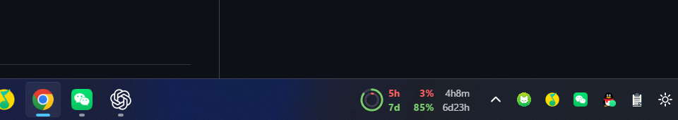
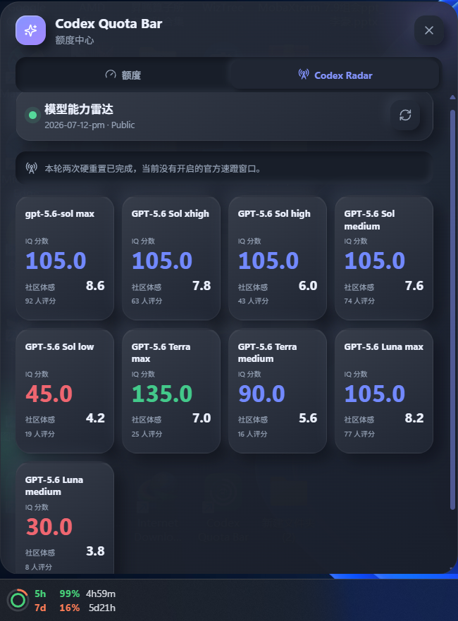
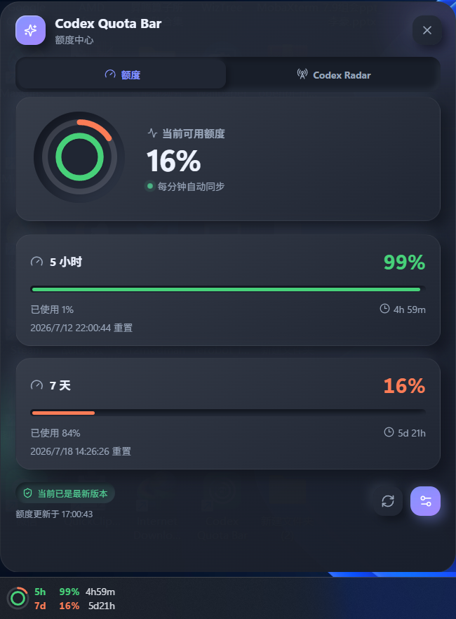

# Codex Quota Bar

简体中文 | [English](README_EN.md)

[](https://github.com/Afterlife-lh/codex-quota-bar/releases)
[](https://github.com/Afterlife-lh/codex-quota-bar/releases/latest)
[](LICENSE)

Codex Quota Bar 是一款轻量级 Windows 工具。它只读复用本机现有的 Codex
ChatGPT 登录状态，并在 Windows 任务栏通知区域旁显示当前账户剩余的 5 小时
和 7 天额度。



## 界面展示

| Codex Radar | 额度详情 |
| --- | --- |
|  |  |

> 界面会随版本持续优化，实际布局和数据以当前版本为准。

## 功能特性

- 透明双行任务栏组件，使用双同心环显示 5h/7d 剩余额度。
- 显示剩余百分比、重置倒计时、连续状态颜色和缓存数据提示。
- 原生托盘图标，提供立即刷新、详情、个性化设置、开机启动和退出功能。
- 详情页内置 Codex Radar，展示公开模型评分、额度雷达与最新信号摘要。
- 可调整宽度、高度、偏移、字体缩放、圆环大小、主题和动画。
- Windows 10 默认放置于托盘左侧。
- Windows 11 支持选择任务栏左/右区域及窗口左/右对齐。
- 支持反转“环形－额度－倒计时”的排列方向。
- 任务图标或托盘图标变化时平滑移动，并持续保持可见。
- 始终启用 Lyricify Lite 自动避让，形成“歌词 → 额度 → 托盘”布局。
- 只读使用 Codex 登录凭据，不实现独立 OAuth 或多账户切换。

## 安装

请从 [GitHub Releases](https://github.com/Afterlife-lh/codex-quota-bar/releases/latest)
下载最新的 x64 MSI 安装包。安装新版本 MSI 可以直接升级已有版本。

## 隐私与兼容性

- 凭据目录优先级为：用户设置的 Codex 目录 → `CODEX_HOME` →
  `%USERPROFILE%\.codex`。
- 访问令牌仅在 Rust 后端内存中用于额度查询，不会写入日志。
- 请勿将个人 `auth.json` 上传到本仓库、Issue 或其他公开位置。
- 本项目使用的 ChatGPT 额度端点属于非公开兼容层，未来可能发生变化。
- 当前仅支持未经修改的主显示器 Windows 任务栏。
- 暂不支持 ExplorerPatcher、StartAllBack 等第三方任务栏修改工具。
- Lyricify Lite 自动避让始终启用。

## 更新日志

### 0.10.0

- 默认关闭自动安装更新；发现新版本时在任务栏显示琥珀色提示点，并在详情页展示版本、更新日志和安装按钮。
- 详情页刷新现在同时刷新额度与可用更新，更新面板带有平滑出现动画。
- 统一 5h、7d 与 Radar 模型卡片的入场速度和位移幅度。
- 重做主题水波纹层级，切换过程中不再遮挡文字并减少卡顿。
- 动态适配服务端返回的额度窗口；缺失的 5h 或 7d 不再占用任务栏行和详情卡片。
- Lyricify Lite 避让改为始终开启，首次定位等待真实托盘边界后再显示，默认宽度调整为 140px。

### 0.9.0

- 修复详情页显示完整内容后才播放入场动画的首帧闪现问题。
- 提升模型卡片鼠标跟随动画的响应速度。
- 主题按钮按当前主题显示太阳或月亮，并加入由按钮向全界面扩散的水波纹切换动画。
- 更新安装程序会等待 MSI 成功完成，并在确认新版可执行文件存在后自动重新启动软件。

### 0.8.0

- 补全详情窗口每次打开时的缩放、位移、透明度和模糊入场动画，并统一所有关闭路径的退场动画。
- 点击详情窗口外部、焦点转移、再次点击任务栏组件时均会播放动画后关闭。
- 增加卡片鼠标位置追踪、柔和聚光、轻量 3D 倾斜、悬停阴影和滚动渐进展示。
- 详情页增加太阳/月亮主题切换按钮，并记忆手动选择。
- Radar 模型卡新增参考价格与参考时间，移除评分人数，并放大模型名称。

### 0.7.0

- 重构 Radar 模型卡信息层级：模型名称、IQ、社区体感、评分人数依次展示。
- 删除任务答对数、社区体感 `/10` 后缀和额度雷达表格，为 8 个模型卡释放更多空间。
- 显式读取 Windows 当前用户系统代理，支持单地址和 `http=…;https=…` 常见格式。
- 额度、Radar 与自动更新请求会在每次连接时重新读取代理，切换系统代理后无需重启应用。

### 0.6.0

- Codex Radar 从固定截断改为动态模型数量，当前完整展示官网的 8 个 IQ 模型。
- 模型顺序与官网保持一致：Sol max→low、Terra xhigh→medium、Luna medium；未来新增模型会自动追加展示。
- 接入滚动 24 小时社区体感评分，在每个 IQ 卡片内同时展示体感均分和投票人数。
- Radar 后台刷新间隔调整为 5 分钟，与社区评分公共缓存频率一致。
- 恢复 GitHub Actions 云端 MSI 构建，用于验证远程自动更新链路。

### 0.5.0

- 新增 Codex Radar 详情页，读取 codexradar.com 公共摘要并展示动态模型评分、任务结果、额度档位和雷达信号。
- 设置页增加 Codex Radar 开关，支持手动刷新与 30 分钟后台刷新。
- 修复内置更新完成后，Windows 将 `\\?\` 扩展路径误解析为 `\\` 文件而无法重启的问题。
- 更新助手改用隐藏 PowerShell 进程执行 MSI、清理安装包并安全重启应用。

### 0.4.1

- 修复额度端点缓存节点返回不同快照时，手动与自动刷新在两组额度间交替的问题。
- 将异常回升保护扩展至所有额度窗口，并在当前窗口重置前要求异常回升连续两次一致才确认。
- 修复暗色任务栏下倒计时和分隔符颜色过暗、难以辨认的问题。

### 0.4.0

- 使用 Soft UI 风格重新设计额度详情页和个性化设置页，支持亮色与暗色主题。
- 放大详情与设置界面的文字和控件说明，提升高分辨率屏幕下的可读性。
- 增加启动动画、卡片入场、进度过渡、按钮反馈和柔和环境动画。
- 增加 GitHub Release 自动更新，默认检查、安装新版本并重启应用。
- 全屏程序运行或任务栏不可见时自动隐藏任务栏组件和辅助窗口。
- 再次点击任务栏额度文字可以关闭已打开的详情页。
- 增加 GitHub Actions Windows MSI 自动发布工作流。

### 0.3.1

- 修复窄宽度下倒计时裁切和反转布局重叠问题。

### 0.3.0

- 增加 Windows 10/11 布局识别、区域与对齐设置、排列反转和移动动画。
- 增加异常额度跳变快速复核机制。

## 本地开发

环境要求：Node.js 20+、pnpm、Rust 1.77.2+、WebView2，以及 Tauri 2
在 Windows 上所需的构建工具。

```powershell
corepack enable
pnpm install
pnpm dev
```

检查与发布构建：

```powershell
pnpm typecheck
pnpm test
cargo test --manifest-path src-tauri/Cargo.toml
pnpm build
```

MSI 安装包输出到 `src-tauri/target/release/bundle/msi/`。

## 第三方署名

凭据解析、额度窗口映射和请求实现参考了采用 MIT 许可证的
[CC Switch](https://github.com/farion1231/cc-switch) 项目。详情请参阅
[THIRD_PARTY_NOTICES.md](THIRD_PARTY_NOTICES.md)。

Codex Radar 集成设计参考了 MIT 许可的
[codex-monitor-macos](https://github.com/jackiemingnew/codex-monitor-macos)，
公开数据来自 [codexradar.com](https://codexradar.com)。
